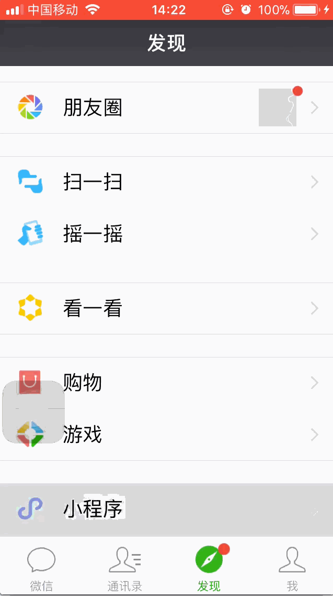

# ios 11.1 非首屏输入框输入文本显示异常

## 开发环境

- 微信版本：6.5.21
- 基础库版本：1.6.4
- 机型：iPhone SE<iPhone8,4>
- 操作系统：iOS 11.1

## 如何复现？

具体测试代码参见 `demo/` 目录。

当底部存在 `position:fixed` 的组件时，会导致首屏之外的输入框输入异常。

具体表现为，在底部输入框输入文字，点击空白区域使其失去焦点后，文字显示为空白。再次点击时，会重新出现文本，说明文字内容还在，只是没有显示。

录屏效果如下：

